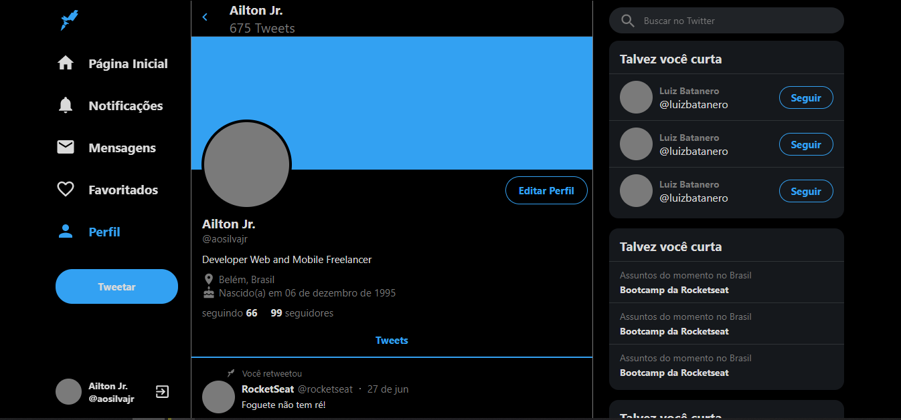
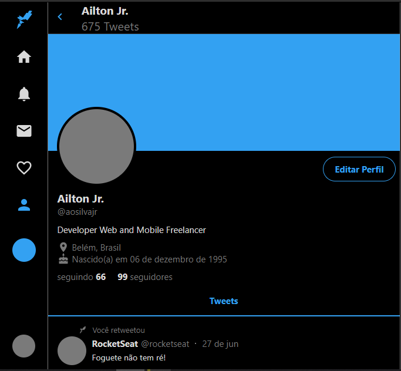
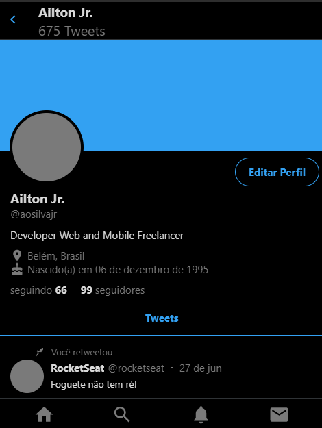

<h1 align="center">
    Twitter UI Clone
</h1>
<p align="center">Clone da interface do Twitter totalmente responsivo com objetivo de estudar a construção de layouts no React JS utilizando styled components e media queries</p>

<p align="center">
	 <a href="https://twitter-ui-clone-947b4.netlify.app/">
    
  </a>
</p>

<p align="center">
	<kbd>
		
	</kbd>
</p>

<p align="center">
	<kbd>
		
	</kbd>
	<kbd>
		
	</kbd>
</p>


🛠 Tecnologias
=================
As seguintes ferramentas foram usadas na construção do projeto:

- [React.js](https://pt-br.reactjs.org/)
- [Typescript](https://www.typescriptlang.org/)
- [Styled Components](https://styled-components.com/)
- [React Sticky Box](https://react-sticky-box.codecks.io/)
- [ESLint Plugin Import Helpers](https://github.com/Tibfib/eslint-plugin-import-helpers)
- [VS Code](https://code.visualstudio.com/) com [EditorConfig](https://editorconfig.org/) e [ESLint](https://eslint.org/)


## :information_source: Como rodar a aplicação

```bash
# Clone this repository
$ git clone https://github.com/aosilvajr/twitter-clone.git

# Go into the repository
$ cd twitter-clone

# Install dependencies
$ yarn install

# Run app
$ yarn start
```

## :memo: License
This project is under the MIT license. See the [LICENSE](https://github.com/aosilvajr/twitter-clone/blob/master/LICENSE) for more information.

---
